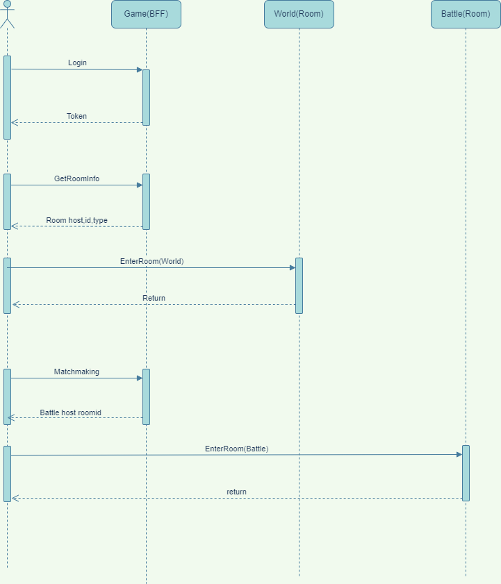

# Rumble EKS 集群

## Architecture


## GameFlow



## Requirements:

* [AWS CLI install](https://docs.aws.amazon.com/zh_cn/cli/latest/userguide/cli-chap-configure.html)
* [kubectl install](https://docs.aws.amazon.com/zh_cn/eks/latest/userguide/create-kubeconfig.html)
* [Helm install](https://helm.sh/docs/intro/install/)

## 集群创建流程

* [EKS Cluster Create](https://docs.aws.amazon.com/zh_cn/eks/latest/userguide/create-cluster.html)
    * IAM 角色权限策略： AmazonEKSClusterPolicy、AmazonEKS_CNI_Policy,AmazonEBSCSIDriverPolicy
* [Amazon EBS CSI install](https://docs.aws.amazon.com/zh_cn/eks/latest/userguide/ebs-csi.html)
* [NodeGroup Create](https://docs.aws.amazon.com/zh_cn/eks/latest/userguide/create-managed-node-group.html)
    * IAM 角色权限策略：
      AmazonEKSWorkerNodePolicy、AmazonEC2ContainerRegistryReadOnly、AmazonEKS_CNI_Policy、AmazonEBSCSIDriverPolicy

## 集群访问

### 配置权限:

 ```shell
   aws configure // 配置aws cli 需要相关权限文件
   aws eks update-kubeconfig --name rumble-prod --region ap-southeast-1
   winget install k9s // 安装k9s
   k9s // 查看集群状态
 ```

## 服务Install

* Login Helm Repo:
   ```shell
   aws ecr get-login-password --region ap-southeast-1 |helm registry login --username AWS --password-stdin  129354786961.dkr.ecr.ap-southeast-1.amazonaws.com
   ```

### Infrastructure:

* Install [mongodb](https://artifacthub.io/packages/helm/bitnami/mongodb)
   ```shell
   helm repo add bitnami https://charts.bitnami.com/bitnami
   helm repo update 
   helm install mongo oci://registry-1.docker.io/bitnamicharts/mongodb 
    ```
* Install [redis](https://artifacthub.io/packages/helm/bitnami/redis)
   ```shell
   helm install redis oci://registry-1.docker.io/bitnamicharts/redis 
    ```
* Install [Nats](https://artifacthub.io/packages/helm/bitnami/nats)
   ```shell
   helm repo add nats https://nats-io.github.io/k8s/helm/charts/
   helm repo update 
   helm upgrade --install nats nats/nats
    ```
* Install [ingress-nginx](https://artifacthub.io/packages/helm/ingress-nginx/ingress-nginx)
    ```shell
       helm repo add ingress-nginx https://kubernetes.github.io/ingress-nginx
       helm repo update 
       helm install nginx -f .\ingress-nginx\values.yaml ingress-nginx/ingress-nginx 
    ```

## 部署cert-manager

[点击查看详细描述](./cert-manager/readme.md)

## 部署 agones

* [点击查看详细描述](./agones/readme.md)

### Rumble services:

* 部署相关secrets

   ```shell
   #iap-secret.yaml比较敏感，不要上传到git仓库
   kubectl apply -f ./iap/iap-secret.yaml
  kubectl apply -f ./secret.yaml
   ```
* Install with jenkins http://192.168.90.29:8080/

## 发布流程：

### 打包：

```shell
aws ecr get-login-password --region ap-southeast-1 | docker login --username AWS --password-stdin 129354786961.dkr.ecr.ap-southeast-1.amazonaws.com
```

* [Jenkins](http://192.168.90.29:8080/)
* 选择指定更新的服务执行对应的任务:
    * [platform-prod](http://192.168.90.29:8080/job/platform-prod/)
    * [rumble-prod](http://192.168.90.29:8080/job/rumble-prod/)

### 发布：

* 修改版本号
    * 修改helm/base/Chart.yaml中的version,appVersion(自增)

* [推荐] 通过helm发布流程会自动创建相关的k8s资源，包括deployment、service、ingress等

   ```shell
  # 替换下面的[ServiceName]为具体的服务名称
  helm upgrade --install [ServiceName] ./helm/base  -f ./helm/[ServiceName]/values.yaml 
   ```
* [不推荐] 发布所有服务流程:
    * 执行Jenkins发布任务[rumble-deploy-prod](http://192.168.90.29:8080/job/rumble-deploy-prod/)

### 问题排查

1. Error saving credentials: error storing credentials - err: exit status 1,
   out: `error storing credentials - err: exit status 1, out: `The stub received bad data.

* 删除 用户/.docker/config.json 文件中 { "credsStore": "desktop" }属性